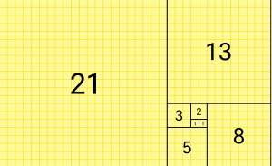

# Fibonacci-Generator
In mathematics, the Fibonacci sequence is a sequence in which each number is the sum of the two preceding ones. Numbers that are part of the Fibonacci sequence are known as Fibonacci numbers, commonly denoted Fn .

## What is the Fibonacci Sequence?
Fibonacci introduced an exponential sequence of numbers, now known as the Fibonacci number or Fibonacci sequence. In the sequence, each number is the sum of the preceding two numbers:

> 0, 1, 2, 3, 5, 8, 13, 21…

The Fibonacci sequence is found in many different disciplines and in nature. For example, it has been used to describe plant life growth, estimate population increases over a specified timeframe, model virus breakouts, and predict the behavior of financial markets. 

[Read more about Fibonacci Sequence](https://en.wikipedia.org/wiki/Fibonacci_sequence)

